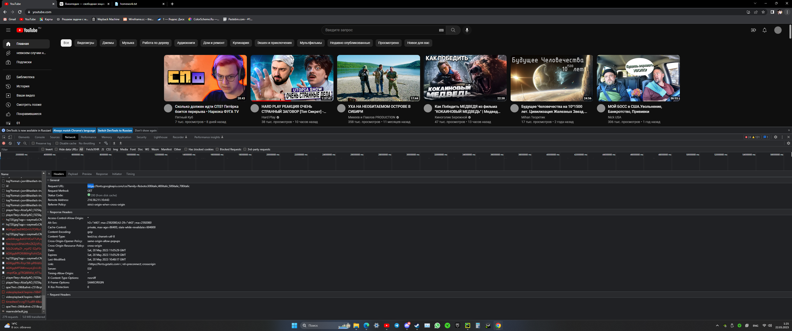
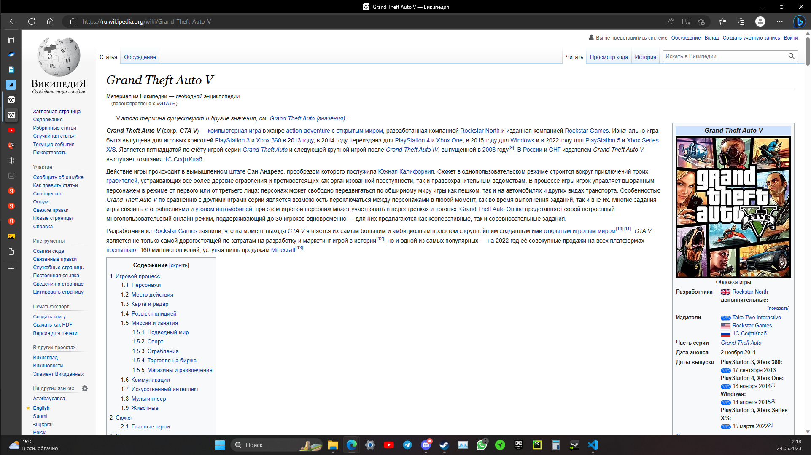
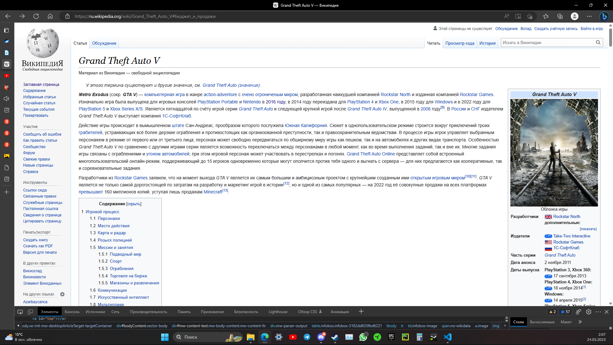

## **Дз за** 20.05.23
## **1_protocol.jpg,**
youtube.com работает на защищенном протоколе так-как его port-443 является зашишёным, или можно понять по https://

## 2_analyze.txt,
На википедииесть есть Шапка в которой можно зарегистрироватся на сайте также пишется назвниия стотьи на которой ты сечяс ноходишся ,Сайт-бар в котором содерзытся сылки которые могут тебе помочть проше орентировотся на сайте, Подвал в котором есть условия использования также есть информацыя о том-что Wikipedia евляется зарегистрированым товарным зноком некомерческой организации, Контент расположен сразу после названия стороницы и разбит на несколько блоков в которых есть некоя инвормацыя котороя интересна множеству других людей и возможно заинтерисует вас.
## 3_before.jpg,
**Оригенал**

**Изменёный**
## 3_after.jpg

## 4_proto.jpg
